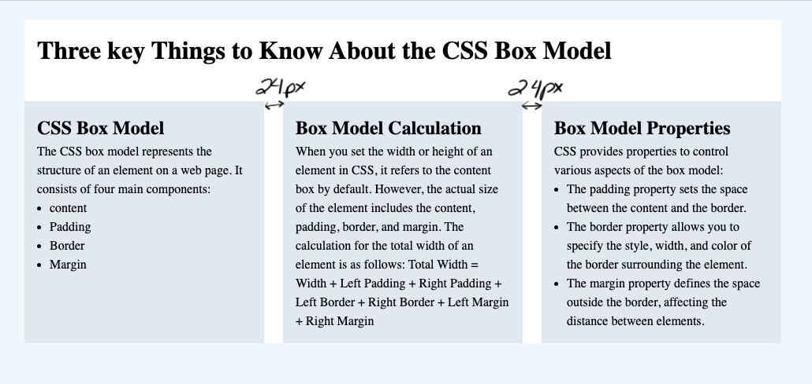

# Flexbox II Exercise Instructions

## Instructions
Download the exercise files. In the starting file you have been given, link the two style sheets and complete the exercise in the styles.css file.

## Build
Use the 960px center page layout to complete the exercise.
- You can choose your own colours for the body element, the container, and the three sections.
- Give the header element a top and bottom margin of 24px and 16px of spacing inside the element on all sides.
- Using your knowledge of flexbox and the box model fit three equally sized sections into the 960px space of the container. 
- Space the sections 24px apart and give them 16px of spacing inside of them. Give the sections a width property and use flex-wrap: wrap on the flex container.
- To style the unordered list, you will have to replace the bullets that the reset file striped away. Give the ul a property of list-style-type: disc and a padding on the left side of 16px;

Your completed file should look like the following image:

## Delivery
Upload your completed file to your dmitstudent account so that the URL will be: username.dmitstudent.ca/css-box-model/