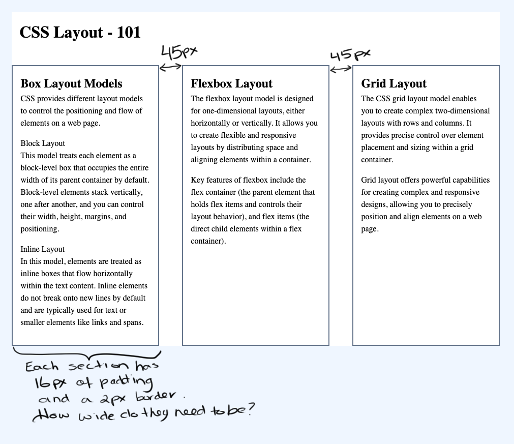

# Flexbox III Exercise Instructions

## Instructions
Download the exercise files. In the starting file you have been given, link the two style sheets and complete the exercise in the styles.css file.

## Build
Use the 960px center page layout to complete the exercise.
- You can choose your own colours for the body element and the container.
- Give the header element a top and bottom margin of 24px and 16px of spacing inside the element on all sides.
- Using your knowledge of flexbox and the box model fit three equally sized sections into the 960px space of the container.
- Each section has 16px of spacing inside of them, and a 2px border all around.
- Space the sections 45px apart.
- Give the paragraph and the description detail (dd) elements a bottom margin of 16px.

Your completed file should look like the following image:

## Delivery
Upload your completed file to your dmitstudent account so that the URL will be: username.dmitstudent.ca/css-layout-101/